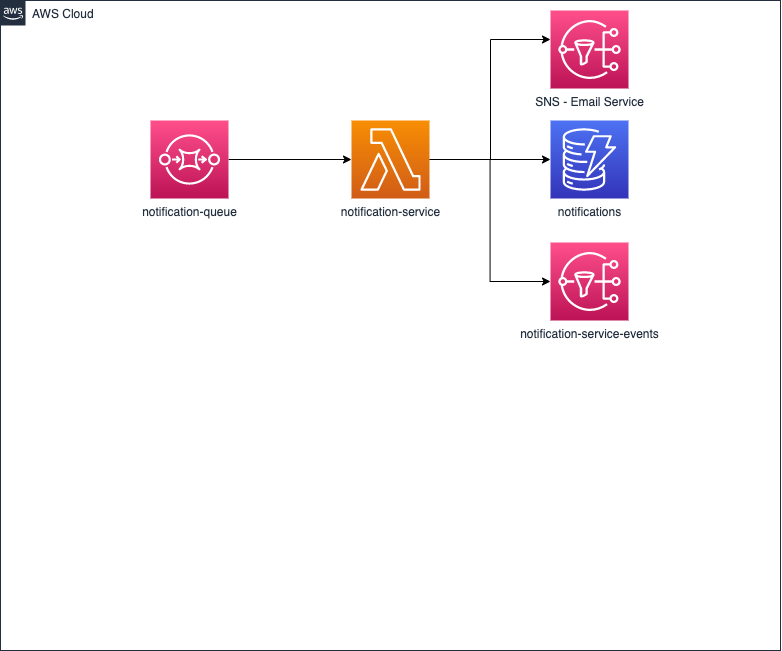

# mk-notification-service

> We have a Notification system that sends out email notifications of various types (status update, daily news, project invitations, etc). We need to protect recipients from getting too many emails, either due to system errors or due to abuse, so let’s limit the number of emails sent to them by implementing a rate-limited version of NotificationService.

The system must reject requests that are over the limit.

Some sample notification types and rate limit rules, e.g.:

Status: not more than 2 per minute for each recipient

News: not more than 1 per day for each recipient

Marketing: not more than 3 per hour for each recipient

Etc. these are just samples, the system might have several rate limit rules!

# Requirements
* Docker
* Node.js 18
* DynamoDB Docker Image
* AWS SAM

# System Design


> notification-service receives a batch of messages from a SQS queue, store notifications in a DynamoDB Table then send notifications to the email service or the push notification service. After that, the notification-service send an event to SNS Topic to notify all the microservices subscribed if the notification was processed ok or not. Lastly, notification-service deletes SQS messages and re enter to the queue failed messages.

## Getting started

Install dependencies

```bash
npm install
```

Start docker locally

Start dynamodb locally
```bash
./src/scripts/start-dynamo-local
```

Run create-db.js script
```bash
NODE_ENV=development node src/scripts/create-db.js
```

You can simulate queue messages with (docker running is required)
```
npm run invokeProcessNotifications
```

## Tests

You can run tests with
```bash
npm test
npm run test:coverage
```
